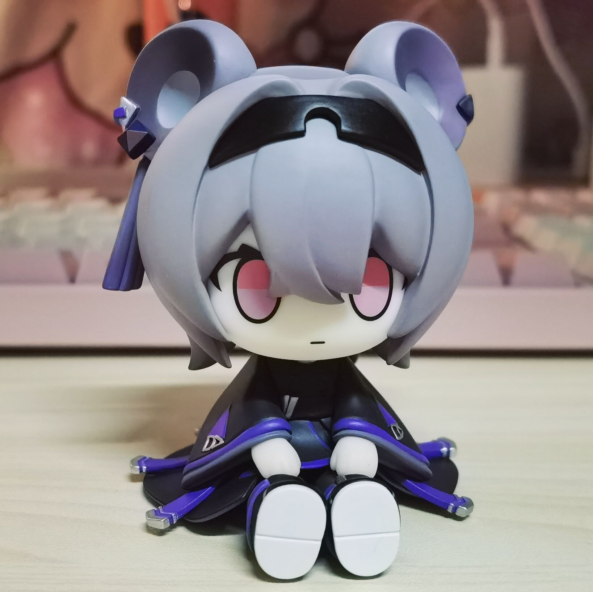

# Yuxia Lin
A toy project to turn the character Yuxia Lin into a voice assistant.

Currently, it can only do voice responses because the task-classification part is not implemented yet. In the future, it is expected to be able to classify the commands and execute some simple tasks.

## Flow
1. Run the project and enter the sleeping stage;
2. Say a word including "Yuxia Lin" (e.g., "哈喽，林雨霞") to activate the assistant;
3. Speak out a command and the assistant will respond to it;
4. Repeat step 3 to do the dialogue;
5. The assistant will go back to the sleeping stage after a period of silence.

## Models Used
#### ASR
The Whisper model of Openai is used.
#### LLM
Currently using ChatGPT with prompts to do the role-play, which performs bad. Working on to fine tuning the llama2 Chinese model with the texts in the game Arknights to obtain a better performance.
#### TTS
##### Bert-VITS2
I trained it with Lin's voice data from the game. Chinese, English and Japanese voice data are all used to train three voices. However, the project currently only supports talking in Chinese. Considering to add the support for English and Japanese in the future.
##### PaddleSpeech (Not Recommended)
I did not train the model with Lin's voice data, also the speed is slow. It is used in the project in the early testing. Anyway, it is an option if you want to try it.
##### PaddleSpeech + so-vits-svc (Not Available Currently)
To support Cantonese, I train the so-vits-svc model with Lin's Cantonese voice data. When generating the audio, the PaddleSpeech model is used to generate the Cantonese voice from the text, and the so-vits-svc model is used to convert it into Lin's voice. However, there are some bugs with it, and the speed is also unacceptable. Appreciate it if you can share any ideas on how to support the Cantonese.

## Other Things
As serveral models are needed to support the functions, the project is designed to be working in a server-client mode. For this reason, the client can be run on common devices only with a microphone and a speaker. This is quite important. As we can see, this repo is just a toy project without actual use. But it is cool to talk with my CUTE CUTE Lin doll, isn't it? 😊

